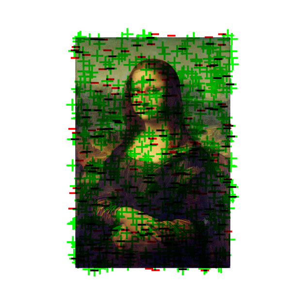

# Zora Coins With Dynamic Artwork

An application that monitors an ERC20 token on Base and visualizes buy/sell transactions as symbols in an SVG image.

Used to create dynamic artwork on Zora Coins.



First used in [liquidity layer](https://zora.co/coin/base:0x5a34646b860485f012435e2486edb375615d1c7b).

## Features

- Fetches transactions for a specific ERC20 token on Base
- Identifies buy and sell transactions based on liquidity pool interactions
- Generates an SVG visualization with symbols representing transactions
- Uses deterministic positioning so the same transaction always appears in the same place
- Includes a background image centered in the canvas
- Symbols can overflow the canvas edges for a dynamic look
- Efficiently handles large transaction volumes (10,000+ transactions)
- Automated updates via scheduled tasks (cron jobs)
- IPFS integration for decentralized storage

## Prerequisites

- Node.js 16+ and npm
- Access to Base (via public RPC endpoint or your own node)
- IPFS provider account (e.g., Infura, Pinata, or Web3.Storage)
- A deployed Zora coin on Base
- Private key of the token admin wallet

## Installation

1. Clone this repository:

   ```bash
   git clone https://github.com/yourusername/token-transaction-visualizer.git
   cd token-transaction-visualizer
   ```

2. Install dependencies:

   ```bash
   npm install
   ```

3. Build the TypeScript code:

   ```bash
   npm run build
   ```

4. Set up your environment variables:

   ```bash
   # Create a .env file from the example
   cp .env.example .env
   ```

5. Configure your `.env` file with the following:

   ```plaintext
   # Your IPFS provider credentials (example using Infura)
   INFURA_IPFS_PROJECT_ID=your_project_id
   INFURA_IPFS_PROJECT_SECRET=your_project_secret

   # Private key of the token admin wallet
   PRIVATE_KEY=your_admin_wallet_private_key
   ```

   Note: For IPFS storage, this project uses Infura by default, but you can modify the code to use other providers such as:

   - Pinata (https://pinata.cloud)
   - Web3.Storage (https://web3.storage)
   - NFT.Storage (https://nft.storage)
   - Your own IPFS node

6. Update `src/constants.ts` with your Zora coin details:

   ```typescript
   // The block number when your token was deployed
   // You can find this in your token's deployment transaction on Basescan
   export const TOKEN_DEPLOY_BLOCK = your_token_deploy_block;

   // Your Zora coin contract address
   export const TOKEN_ADDRESS = "your_token_address";
   ```

   Other constants you may want to adjust:

   - `MAX_TRANSACTIONS`: Maximum number of transactions to process (default: 10000)
   - `BATCH_SIZE`: Number of transactions to fetch per batch (default: 2000)
   - `BATCH_DELAY`: Delay between batch requests in milliseconds (default: 1000)
   - `BASE_RPC_URL`: Base RPC URL (default: "https://mainnet.base.org")
   - `BG_IMAGE`: Background image for the visualization (base64 encoded PNG)

## Usage

### Local Development

#### Individual Commands

To fetch the latest transactions for the token:

```bash
npm run fetch
```

This will retrieve transactions from the Base and save them to `src/data/transactions.json`.

#### Generate SVG Visualization

To generate an SVG visualization from the fetched transactions:

```bash
npm run generate
```

This will read the transaction data from the JSON file and create an SVG at `src/output.svg`.

#### Run the Complete Process

To fetch transactions and generate the visualization in one step:

```bash
npm run start
```

This will fetch transactions and generate the visualization in one step.

### Production Deployment

This project is designed to be deployed on Render.com, but you can use any hosting service that supports Node.js and cron jobs (e.g., Heroku, DigitalOcean, AWS).

#### Deploying on Render.com

1. Create a new Web Service on Render.com:

   - Connect your GitHub repository
   - Choose a name for your service
   - Set the build command: `npm install && npm run build`
   - Set the start command: `node dist/index.js`

2. Add Environment Variables:

   - Go to your web service's "Environment" tab
   - Add all variables from your `.env` file
   - Make sure to keep your `PRIVATE_KEY` secure and never commit it to the repository

3. Set up the Cron Job:
   - In your web service settings, go to the "Cron Jobs" tab
   - Create a new cron job
   - Set the schedule (e.g., `*/30 * * * *` for every 30 minutes)
   - Set the command to: `npm run start`
   - The cron job will automatically fetch new transactions and update the visualization
   - Each run will update both the transaction data and the SVG visualization

#### Alternative Deployment Options

You can deploy this project on any platform that supports Node.js and cron jobs:

- Heroku: Use the Heroku Scheduler add-on
- AWS: Use CloudWatch Events/EventBridge
- DigitalOcean: Use the built-in App Platform with scheduled jobs
- GitHub Actions: Use scheduled workflows
